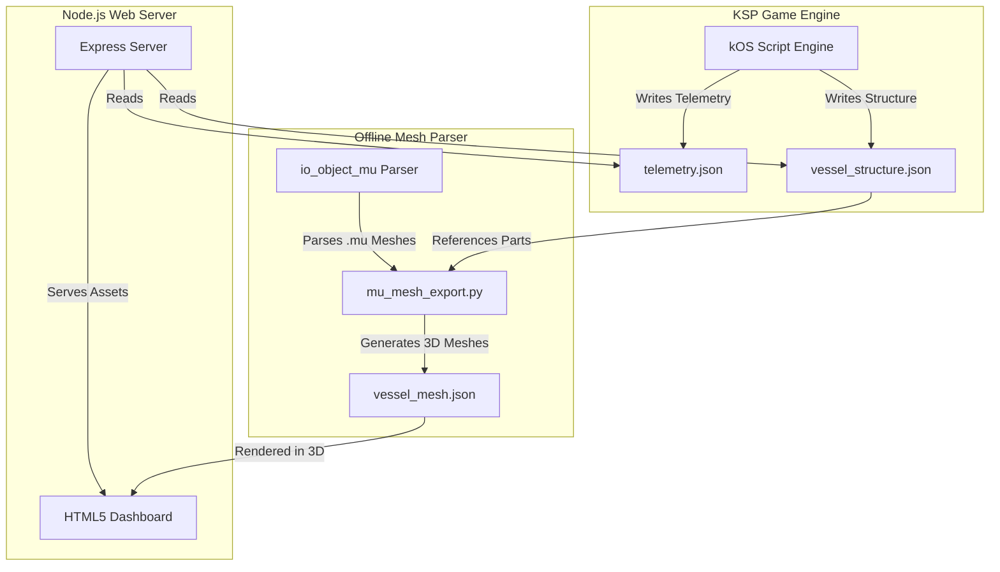

# DASA KSP Mission Control & Autopilot (KOSHUD)

A premium, real-time telemetry dashboard, offline 3D part mesh visualizer, and autonomous orbital autopilot suite for **Kerbal Space Program (KSP)** using **kOS (Kerbal Operating System)**.

---

## 📊 Project Overview

**KOSHUD** (DASA Mission Control) bridges the gap between in-game flight execution and external web-based mission control interfaces. It features an automated flight computer library, telemetry exporter, Node.js server, and a fully interactive HTML5 dashboard featuring attitude projections, vessel structures, and real-time flight metrics.



---

## ✨ Features

- **🚀 Reusable Autopilot Suite (`SpaceCore`)**:
  - Ascent profile automation and automated gravity turns.
  - Automated circularization at Apoapsis/Periapsis.
  - Orbital maneuver executors (Hohmann transfers, inclination adjustments, phase changes, orbital intercepts).
  - Advanced docking and landing control using RCS translation and suicide burn algorithms.
- **📈 Real-Time Telemetry Dashboard**:
  - Stable attitude calculations projected onto the local **East-North-Up (ENU)** navball coordinate system.
  - Live trajectory metrics (altitude, orbital velocity, target distance, time-to-closest-approach).
  - Status tracking with automated events and logs.
- **🏗️ Offline 3D Vessel Visualizer**:
  - Extracts raw `.mu` binary model files directly from your KSP `GameData/` directory.
  - Automatically decimates high-poly part geometry to optimize JSON payloads.
  - Reconstructs your active vessel's structure dynamically on the browser-based dashboard.

---

## 📂 Repository Structure

- `DASA/` - Mission-specific coordination scripts (e.g., Minmus automation, probe deployment).
- `SpaceCore/` - Modular, reusable autopilot libraries (ascent, node execution, intercepts, landing, docking).
- `KOSmodore/` - Core utility libraries (terminal interfaces, filesystem tools, GPS, hovering).
- `dashboard/` - Frontend HTML5/JS telemetry UI.
- `telemetry_server/` - Express.js backend and Python mesh parsing utilities.
- `telemetry/` - Temporary data store for active flight telemetry and structure payloads.
- `logs/` - Event logs and debugging outputs.
- `antigravity_notes/` - System design documentation, orbital mechanics calculations, and AI decision notes.

---

## ⚡ Quick Start

### 1. Prerequisites
- **Kerbal Space Program** (v1.12.x recommended) with the **kOS** mod installed.
- **Node.js** (LTS version) & **NPM**.
- **Python 3.x** (with standard library).

> [!IMPORTANT]
> Because the automation script size exceeds the default capacity of standard KSP flight computer parts, you **MUST** enable **"Start on the Archive"** in the KSP game settings under the kOS category.

### 2. Running the System
1. Stage or boot your craft in-game running the kOS telemetry scripts.
2. In this repository root, execute the Python launcher to boot the server and open the browser dashboard automatically:
   ```powershell
   python launch_dashboard.py
   ```
3. Alternatively, you can run the batch or PowerShell scripts directly:
   - `start_telemetry_server.bat`
   - `./start_telemetry_server.ps1`

---

## ⚖️ Dependency & License Audit

Below is an audit of the libraries and tools integrated into this project:

| Dependency / Component | Origin / Source | License | Copyleft? | Description |
| :--- | :--- | :--- | :--- | :--- |
| **Express.js** | NPM Registry | **MIT** | No | Lightweight backend web server routing telemetry. |
| **SpaceCore** | bodryxon | **MIT** | No | Reusable autopilot scripts for orbital maneuvers. |
| **io_object_mu** | taniwha | **GNU GPL v2** | **Yes (Strong)** | Blender `.mu` mesh parser used for offline 3D vessel reconstruction. |
| **kOS** | KSP Community | **GNU GPL v3** | **Yes (Strong)** | Flight computer runtime environment (external dependency). |

### ⚠️ License Conflict: MIT vs. GPL v2

Your project is currently designated as using the **MIT License**. However, bundling the **`io_object_mu`** python package directly inside the repository (`telemetry_server/io_object_mu/`) introduces a licensing conflict:

1. **GPL v2 Copyleft Requirement**: Under Section 2(b) of the GNU General Public License v2, if you distribute a combined or derivative work that contains a GPL-licensed component, the **entire work** must be licensed as a whole under GPL v2.
2. **The Bundle Issue**: Since `io_object_mu` is checked directly into the git repository and distributed alongside the rest of your custom code, the repository as a package violates the GPL v2 terms if distributed under the MIT license.

---

## 💡 Licensing Advice & Solutions

To maintain legal compliance, you can choose one of the following two paths:

### Option A: Transition the Project to GPL v2 (or GPL v3) (Recommended for simplicity)
Adopt the GPL v2/v3 license for the entire repository. This fully satisfies the copyleft requirements of `io_object_mu` and allows you to keep bundling the mesh parser directly in the repository.
- **Action**: Rename/create a `LICENSE` file containing the GPL text, and update the license declarations.

### Option B: Keep the MIT License (Recommended for permissive code sharing)
If you wish to keep your repository licensed strictly under the MIT license, you **must not distribute** the `io_object_mu` directory in your git repository. Instead, treat it as an external dependency fetched on the user's machine at install-time:
1. **Remove from Git**: Delete the `telemetry_server/io_object_mu` directory from the repository and add it to `.gitignore`.
2. **Automate the Fetch**: Update `launch_dashboard.py` or create a setup script that automatically clones/downloads the parser from its official source repository at runtime:
   ```python
   # Example runtime download logic
   import urllib.request
   import zipfile
   
   if not os.path.exists("telemetry_server/io_object_mu"):
       print("Fetching GPL dependency io_object_mu from source...")
       # Logic to download release zip from github.com/taniwha/io_object_mu and extract
   ```
This bypasses the distribution trigger of the GPL copyleft clause, allowing your repository to remain 100% MIT licensed, as the combination of licenses only occurs privately on the end-user's machine.