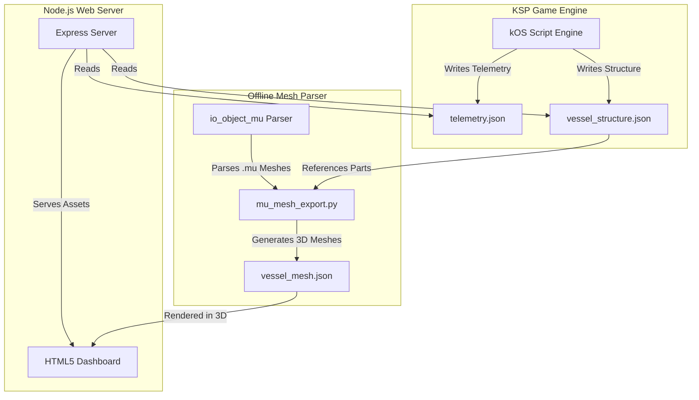

# DASA KSP Mission Control & Autopilot (KOSHUD)

A real-time telemetry dashboard, offline 3D part mesh visualizer, and autonomous orbital autopilot suite for Kerbal Space Program (KSP) using Kerbal Operating System (kOS).

---

## Project Overview

KOSHUD (DASA Mission Control) connects in-game flight systems to an external web-based dashboard. The system comprises an automated flight computer library, telemetry exporter, Node.js server, and an interactive HTML5 dashboard displaying attitude projections, vessel structure, and real-time flight metrics.



---

## Features

### Autopilot Suite (SpaceCore)
- Ascent profile automation and automated gravity turns.
- Circularization at Apoapsis and Periapsis.
- Orbital maneuver execution (Hohmann transfers, inclination adjustments, phasing, and intercepts).
- Docking and landing algorithms using RCS translation and suicide burn controls.

### Real-Time Telemetry Dashboard
- Pitch, yaw, and roll calculations projected onto the local East-North-Up (ENU) coordinate basis.
- Telemetry metrics including altitude, orbital velocity, target distance, and time-to-closest-approach.
- Event logs and status updates streamed to the UI.

### Offline 3D Vessel Visualizer
- Offline extraction of KSP .mu binary model meshes from GameData.
- Mesh decimation to optimize JSON payload sizes.
- Real-time vessel structure rendering and part tracking.

---

## Repository Structure

- `DASA/`: Mission coordination scripts (e.g., Minmus automation, probe deployment).
- `SpaceCore/`: Modular autopilot libraries (ascent, node execution, intercepts, landing, docking).
- `KOSmodore/`: Standard utility libraries (terminal interfaces, filesystem tools, GPS, hovering).
- `dashboard/`: Frontend HTML5/JS telemetry dashboard.
- `telemetry_server/`: Express.js backend and Python mesh parsing utilities.
- `telemetry/`: Telemetry and structure files generated during flight.
- `logs/`: Autopilot logs and event logs.
- `antigravity_notes/`: Design documentation, mathematical derivations, and project notes.

---

## Quick Start

### 1. Prerequisites
- **Kerbal Space Program** (v1.12.x) with the **kOS** mod.
- **Astrogator** and **kOS-Astrogator** mods (for maneuver node planning).
- **Node.js** (LTS) and **NPM**.
- **Python 3.x**.

> [!IMPORTANT]
> The automation scripts require the kOS option "Start on the Archive" to be enabled in KSP settings, as the library size exceeds standard in-game CPU memory limits.

### 2. Launching the System
1. Stage or boot the vessel in-game with the telemetry script active.
2. In the repository root, start the Node.js server and open the dashboard:
   ```powershell
   python launch_dashboard.py
   ```
3. Alternately, execute the server wrapper scripts directly:
   - `start_telemetry_server.bat`
   - `./start_telemetry_server.ps1`

---

## Dependencies and Licensing

The project components and their licenses are audited below:

| Component | License | Role |
| :--- | :--- | :--- |
| **Express.js** | MIT | Telemetry routing backend server. |
| **SpaceCore** | MIT | Reusable autopilot library. |
| **io_object_mu** | GNU GPL v2 | Mesh parser library (external dependency). |
| **kOS Mod** | GNU GPL v3 | Runtime environment. |
| **Astrogator & kOS-Astrogator** | GNU GPL v3 | Transfer calculation and node planning addon. |

To ensure repository compliance with the permissive MIT license, the GPL-licensed `io_object_mu` dependency is excluded from repository distribution via `.gitignore` and is cloned dynamically at runtime by `launch_dashboard.py`.

For the detailed dependency analysis and design choices, see [licensing_and_dependencies.md](file:///c:/Program%20Files%20%28x86%29/Steam/steamapps/common/Kerbal%20Space%20Program/Ships/Script/antigravity_notes/licensing_and_dependencies.md).